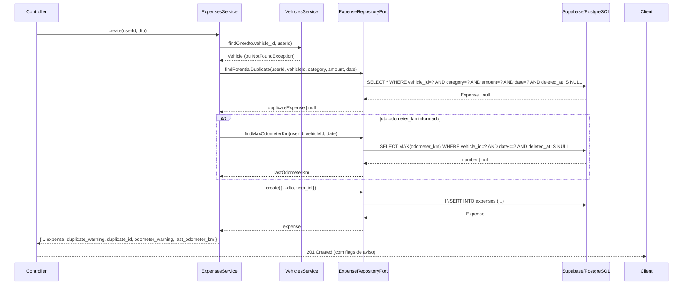

# ADR-001: Regras de Inserção de Despesas (Detecção de Duplicatas e Validação de Odômetro)

## Status

Accepted

## Contexto

O módulo `expenses` é o núcleo operacional do navestory SaaS: registra cada abastecimento, manutenção avulsa e despesa de frota por veículo e usuário. Com o crescimento do volume de lançamentos — especialmente via importação em lote ou uso offline com sincronização posterior — dois problemas de qualidade de dados emergiram:

**1. Duplicatas acidentais**
Lançamentos idênticos (mesmo `vehicle_id`, `category`, `amount` e `date`) podem ser inseridos mais de uma vez por clique duplo, retry de rede ou importação CSV com sobreposição de período. Atualmente não há nenhuma salvaguarda no Service ou no banco.

**2. Sequência de odômetro incoerente**
O campo `odometer_km` é opcional (`number | null`), mas quando informado deve, idealmente, ser crescente no tempo. Registros retroativos legítimos (lançamentos feitos no passado com data retroativa) e correções manuais tornam a regra rígida inviável. Atualmente o valor é aceito sem nenhuma verificação.

### Estado atual verificado no código

```
apps/api/src/modules/expenses/expenses.service.ts   — nenhuma checagem de duplicata ou odômetro
apps/api/src/modules/expenses/entities/expense.entity.ts — campo odometer_km: number | null
apps/api/src/modules/expenses/dto/create-expense.dto.ts  — odometer_km: opcional, sem validação de sequência
apps/api/src/modules/expenses/repositories/supabase-expense.repository.ts — insert sem guard de duplicata
```

O padrão **Repository Port & Adapter** já está em uso: `ExpenseRepositoryPort` (porta abstrata) e `SupabaseExpenseRepository` (adaptador). Isso torna viável injetar lógica de guarda no Service sem tocar no repositório.

---

## Decisões

### D1 — Detecção de Duplicatas: Estratégia B (soft warning)

**Decisão:** ao criar uma despesa, o Service verifica se já existe um registro ativo (`deleted_at IS NULL`) com os mesmos `vehicle_id`, `category`, `amount` e `date` para o mesmo `user_id`. Se existir, a despesa é **criada normalmente**, mas a resposta inclui a flag `duplicate_warning: true` e o `id` do possível duplicado.

**Justificativa:**

- Preserva lançamentos legítimos com valores iguais em dias iguais (ex: dois abastecimentos no mesmo dia com mesmo valor).
- Não bloqueia importações em lote em andamento.
- Devolve informação acionável ao frontend sem gerar erros HTTP que quebrem fluxos automatizados.
- O usuário pode revisar e excluir o duplicado se quiser — decisão permanece humana.

**Estratégias descartadas:**

| Estratégia | Descrição                   | Por que descartada                                                             |
| ---------- | --------------------------- | ------------------------------------------------------------------------------ |
| A — Rígida | Rejeitar com `409 Conflict` | Falsos positivos em lançamentos legítimos idênticos; quebra importação em lote |
| C — Livre  | Não implementar             | Acumula silenciosamente dados duplicados, distorce relatórios e KPIs           |

**Implementação esperada:**

```typescript
// ExpenseRepositoryPort — novo método a adicionar
abstract findPotentialDuplicate(
  userId: string,
  vehicleId: string,
  category: string,
  amount: number,
  date: string,
): Promise<Expense | null>;

// ExpensesService.create() — lógica adicionada
const duplicate = await this.expenseRepository.findPotentialDuplicate(
  userId, dto.vehicle_id, dto.category, dto.amount, dto.date,
);
const expense = await this.expenseRepository.create({ ...dto, user_id: userId });
return { ...expense, duplicate_warning: !!duplicate, duplicate_id: duplicate?.id ?? null };
```

O campo `duplicate_warning` **não é persistido no banco** — é calculado em tempo de execução e retornado apenas na resposta de criação.

---

### D2 — Validação de Odômetro: Estratégia B (soft warning)

**Decisão:** quando `odometer_km` for informado, o Service busca o maior valor de `odometer_km` registrado para aquele `vehicle_id` até a `date` informada. Se o novo valor for menor que o máximo histórico, a despesa é **criada normalmente**, mas a resposta inclui `odometer_warning: true` e `last_odometer_km` para referência.

**Justificativa:**

- Lançamentos retroativos são casos de uso reais e legítimos (ex: usuario que lança despesas semanalmente com datas retroativas).
- Troca de veículo, reset de hodômetro ou erro de digitação são cenários que uma regra rígida não consegue distinguir automaticamente.
- Soft warning permite que o frontend exiba um alerta visual sem bloquear o fluxo de entrada.
- Mantém a integridade do dado no banco sem impedir o registro.

**Estratégias descartadas:**

| Estratégia | Descrição                               | Por que descartada                                                                           |
| ---------- | --------------------------------------- | -------------------------------------------------------------------------------------------- |
| A — Rígida | Rejeitar com `422 Unprocessable Entity` | Bloqueia lançamentos retroativos legítimos; aumenta fricção sem benefício claro              |
| C — Livre  | Não validar                             | Dados de odômetro incoerentes distorcem cálculos de km/L, custo/km e previsões de manutenção |

**Implementação esperada:**

```typescript
// ExpenseRepositoryPort — novo método a adicionar
abstract findMaxOdometerKm(
  userId: string,
  vehicleId: string,
  beforeDate: string,
): Promise<number | null>;

// ExpensesService.create() — lógica adicionada
let odometerWarning = false;
let lastOdometerKm: number | null = null;
if (dto.odometer_km != null) {
  lastOdometerKm = await this.expenseRepository.findMaxOdometerKm(
    userId, dto.vehicle_id, dto.date,
  );
  if (lastOdometerKm != null && dto.odometer_km < lastOdometerKm) {
    odometerWarning = true;
  }
}
const expense = await this.expenseRepository.create({ ...dto, user_id: userId });
return { ...expense, odometer_warning: odometerWarning, last_odometer_km: lastOdometerKm };
```

---

### D3 — EventBus / Domain Events: Adiado

**Decisão:** não implementar EventBus ou Domain Events neste ciclo.

**Justificativa:** o `AuditService` é o único listener atual de eventos pós-criação de despesa. Introduzir um barramento de eventos para um único consumidor agrega complexidade de infraestrutura sem benefício proporcional. A decisão deve ser revisitada quando surgir um segundo listener independente (ex: notificação push, integração com sistema de frotas externo).

**Critério de reabertura:** segundo subscriber de um mesmo evento de domínio.

---

### D4 — Factory de Entidades: Adiado

**Decisão:** não introduzir Factory de entidades no `ExpensesService` neste ciclo.

**Justificativa:** há uma única variante de `Expense`. Factories agregam valor quando existem ao menos três variantes concretas de uma mesma entidade ou quando a lógica de construção se torna não trivial. O padrão pode ser introduzido junto com a ADR de grupos de veículos se `Expense` ganhar subtipos.

---

## Fluxo de criação de despesa (estado futuro)



---

## Consequências

### Positivas

- Qualidade dos dados melhora sem bloquear fluxos legítimos.
- O frontend pode exibir alertas contextuais para que o usuário tome decisão consciente.
- Nenhuma mudança de schema de banco é necessária — as flags são calculadas em runtime.
- A porta abstrata (`ExpenseRepositoryPort`) cresce com dois métodos bem definidos, mantendo o adaptador desacoplado.
- Testes unitários do Service ficam mais ricos: é possível simular cenários de duplicata e odômetro regressivo de forma isolada.

### Negativas

- Dois novos métodos no `ExpenseRepositoryPort` exigem implementação correspondente no `SupabaseExpenseRepository` e atualização dos mocks nos testes.
- A query `findPotentialDuplicate` adiciona uma leitura extra no caminho crítico de criação (impacto estimado: < 5 ms com índice composto em `(user_id, vehicle_id, category, date)`).
- A query `findMaxOdometerKm` só é executada quando `odometer_km` é informado — impacto condicional.
- O tipo de retorno de `create()` no Service se torna diferente do tipo `Expense` puro; é necessário definir um tipo `CreateExpenseResponse` ou um DTO de saída anotado no Swagger.

### Índices recomendados no banco

```sql
-- Para detecção de duplicatas
CREATE INDEX IF NOT EXISTS idx_expenses_dup_check
  ON expenses (user_id, vehicle_id, category, amount, date)
  WHERE deleted_at IS NULL;

-- Para consulta de odômetro máximo
CREATE INDEX IF NOT EXISTS idx_expenses_odometer
  ON expenses (user_id, vehicle_id, date, odometer_km)
  WHERE deleted_at IS NULL AND odometer_km IS NOT NULL;
```

---

## Referências

- `apps/api/src/modules/expenses/expenses.service.ts`
- `apps/api/src/modules/expenses/repositories/expense.repository.port.ts`
- `apps/api/src/modules/expenses/repositories/supabase-expense.repository.ts`
- `apps/api/src/modules/expenses/entities/expense.entity.ts`
- ADR-002: Estratégia de RLS no Supabase (contexto de segurança multi-tenant)
- [Martin Fowler — Soft Delete](https://martinfowler.com/eaaDev/SoftDelete.html)
