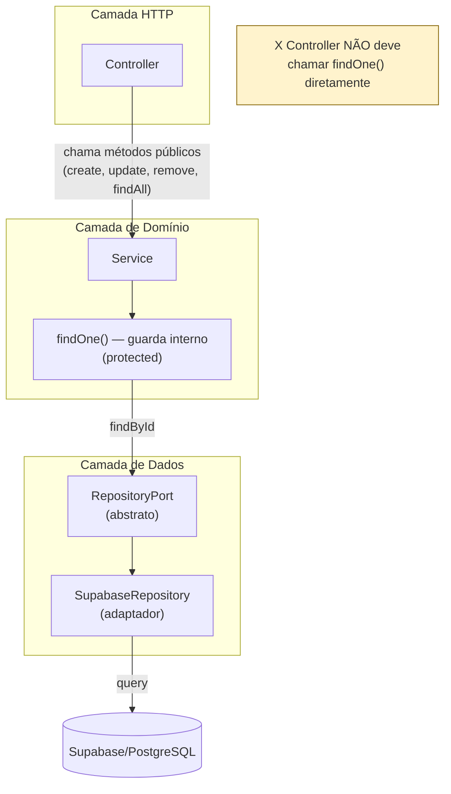

# ADR-002: Encapsulamento de `findOne()` nos Domain Services

## Status

Accepted

## Contexto

O padrão **Repository Port & Adapter** está aplicado em todos os quatro módulos de domínio do projeto:

| Módulo | Service | Porta Abstrata |
|---|---|---|
| expenses | `ExpensesService` | `ExpenseRepositoryPort` |
| vehicles | `VehiclesService` | `VehicleRepositoryPort` |
| maintenance | `MaintenanceService` | `MaintenanceRepositoryPort` |
| users | `UsersService` | `UserRepositoryPort` |

Em três desses módulos (`expenses`, `vehicles`, `maintenance`), os Services expõem um método `findOne()` com a seguinte responsabilidade exclusiva:

1. Buscar o registro pelo ID e `userId` via repositório.
2. Lançar `NotFoundException` se o registro não existir ou não pertencer ao usuário.
3. Retornar a entidade validada para uso interno em `update()`, `remove()` e operações compostas.

**O problema:** `findOne()` está declarado como `public` em todos os services, tornando-o parte da API pública do módulo. Isso contradiz sua natureza: é um método de guarda interno que nunca deve ser chamado diretamente por consumidores externos (controllers de outros módulos, guards, etc.) — esses consumidores devem passar pelo Controller, que detém o contexto HTTP e as validações de entrada.

### Evidência no código

**`ExpensesService`** — usa `findOne()` internamente em `update()` e `remove()`:

```typescript
// expenses.service.ts
async update(id: string, userId: string, dto: UpdateExpenseDto) {
  const existing = await this.findOne(id, userId);   // uso interno
  ...
}

async remove(id: string, userId: string) {
  await this.findOne(id, userId);                    // uso interno
  ...
}
```

**`VehiclesService`** — `findOne()` é chamado externamente por `ExpensesService` e `MaintenanceService`:

```typescript
// expenses.service.ts
async create(userId: string, dto: CreateExpenseDto) {
  await this.vehiclesService.findOne(dto.vehicle_id, userId);  // chamada cruzada
  ...
}

// maintenance.service.ts
async create(userId: string, dto: CreateMaintenanceDto) {
  await this.vehiclesService.findOne(dto.vehicle_id, userId);  // chamada cruzada
  ...
}
```

Aqui está o ponto crítico de distinção:

- O `findOne()` de `ExpensesService` e `MaintenanceService` é puramente interno — **deve ser `protected`**.
- O `findOne()` de `VehiclesService` é legitimamente consumido por outros services para validar posse do veículo — **deve permanecer `public`**, mas ser renomeado para deixar clara a intenção.

### Estado atual em `UsersService`

`UsersService` não expõe `findOne()`. Usa `getProfile()` internamente. Não há problema de encapsulamento neste módulo.

---

## Decisão

### D1 — Tornar `findOne()` `protected` em `ExpensesService` e `MaintenanceService`

Mudar o modificador de acesso de `findOne()` para `protected` nos dois services onde ele é estritamente interno:

```typescript
// ANTES
async findOne(id: string, userId: string) { ... }

// DEPOIS
protected async findOne(id: string, userId: string) { ... }
```

Services afetados:
- `apps/api/src/modules/expenses/expenses.service.ts`
- `apps/api/src/modules/maintenance/maintenance.service.ts`

### D2 — Manter `findOne()` `public` em `VehiclesService`, com renomeação semântica opcional

`VehiclesService.findOne()` tem um uso legítimo como **validador de posse cruzada**: outros services o chamam para garantir que um `vehicle_id` fornecido pelo usuário pertence ao `userId` antes de associar um novo lançamento. Esse é um contrato de domínio válido.

A renomeação para `assertVehicleOwnership(vehicleId, userId)` é **opcional** neste ciclo, pois traria clareza semântica mas exigiria atualização em todos os pontos de chamada. Fica como recomendação para a próxima refatoração planejada do módulo de vehicles.

### D3 — Nenhuma mudança em `UsersService`

`UsersService` usa `getProfile()` internamente, sem expor um `findOne()` público. Está alinhado com o encapsulamento desejado.

---

## Relação com o Repository Pattern

O Repository Port & Adapter isola o acesso a dados atrás de uma porta abstrata. O Service, por sua vez, é a camada que:

1. Valida posse/autorização (multi-tenant check).
2. Orquestra chamadas ao repositório.
3. Lança exceções de domínio (`NotFoundException`, `ForbiddenException`).



O `findOne()` `protected` continua acessível a subclasses do Service (caso haja extensão futura via herança) mas fica invisível para injetores externos — o TypeScript emitirá erro de compilação se um Controller ou outro Service tentar chamá-lo.

---

## Serviços afetados — resumo

| Service | `findOne()` atual | Ação | Motivo |
|---|---|---|---|
| `ExpensesService` | `public` | Mudar para `protected` | Usado apenas internamente em `update()` e `remove()` |
| `VehiclesService` | `public` | Manter `public` | Usado legitimamente por `ExpensesService` e `MaintenanceService` como validador de posse |
| `MaintenanceService` | `public` | Mudar para `protected` | Usado apenas internamente em `update()`, `remove()` e `findByVehicle()` |
| `UsersService` | Não existe (`getProfile()`) | Nenhuma ação | Já encapsulado corretamente |

---

## Consequências

### Positivas

- O TypeScript passa a **enforçar** o encapsulamento em tempo de compilação: qualquer chamada acidental a `findOne()` de fora do Service gera erro `TS2445 (Property is protected)`.
- Elimina o risco de um Controller ou Guard futuro chamar `findOne()` diretamente, bypassando a camada de Controller que centraliza validação de DTO e autenticação.
- Torna a intenção arquitetural explícita no código: leitores do Service imediatamente entendem que `protected findOne()` é um detalhe de implementação, não parte da API do módulo.
- Reduz a superfície pública do Service, facilitando refatorações futuras (ex: se `findOne()` precisar mudar de assinatura, o impacto fica contido dentro do módulo).
- Alinha `ExpensesService` e `MaintenanceService` com o princípio de mínima superfície pública (Principle of Least Privilege aplicado a API de objetos).

### Negativas

- Testes unitários que instanciam o Service diretamente e chamam `findOne()` precisarão ser ajustados para usar `(service as any).findOne()` ou testar os métodos públicos que o invocam (`update`, `remove`). Isso é uma prática melhor de teste — testar comportamento, não implementação interna.
- A mudança em `VehiclesService` (renomeação semântica opcional) fica pendente, criando uma inconsistência temporária de nomenclatura entre os modules.

### Impacto em testes existentes

Os arquivos de teste afetados pela mudança para `protected`:

- `apps/api/src/modules/expenses/expenses.service.spec.ts`
- `apps/api/src/modules/maintenance/maintenance.service.spec.ts` (se existir)

Nos specs, chamadas diretas a `service.findOne()` devem ser substituídas por chamadas aos métodos públicos que o envolvem, ou por `(service as any).findOne()` para testes de unidade focados no comportamento interno.

---

## Alternativas consideradas

### Alternativa 1: Extrair para método privado (`private`)

`private` em TypeScript impede acesso em subclasses. Como o padrão de Services do NestJS raramente usa herança atualmente, `private` seria tecnicamente viável, mas eliminaria a possibilidade de extensão futura (ex: `AdminExpensesService extends ExpensesService` para operações admin que precisem do mesmo guard). `protected` é mais flexível com o mesmo benefício de encapsulamento.

### Alternativa 2: Não mudar (manter `public` implícito)

Manter o status quo. Descartada porque: (a) expõe API que não deve ser pública, (b) acumula dívida técnica à medida que o número de Services cresce, e (c) não comunica intenção arquitetural ao time.

### Alternativa 3: Mover lógica de guarda para um Decorator ou Guard NestJS

Usar `@CheckOwnership()` como decorator de método ou um `CanActivate` guard para centralizar a validação de posse. Descartada neste ciclo porque: (a) a validação de posse é parte da lógica de negócio (o Service precisa do registro para operar), não apenas uma barreira de acesso; (b) a complexidade de implementar um guard genérico com type-safety supera o benefício neste estágio do projeto.

---

## Referências

- `apps/api/src/modules/expenses/expenses.service.ts`
- `apps/api/src/modules/vehicles/vehicles.service.ts`
- `apps/api/src/modules/maintenance/maintenance.service.ts`
- `apps/api/src/modules/users/users.service.ts`
- [TypeScript Handbook — Access Modifiers](https://www.typescriptlang.org/docs/handbook/2/classes.html#member-visibility)
- [NestJS Docs — Providers](https://docs.nestjs.com/providers)
- ADR-001: Regras de Inserção de Despesas (contexto de uso de `findOne()` nos fluxos de criação)
